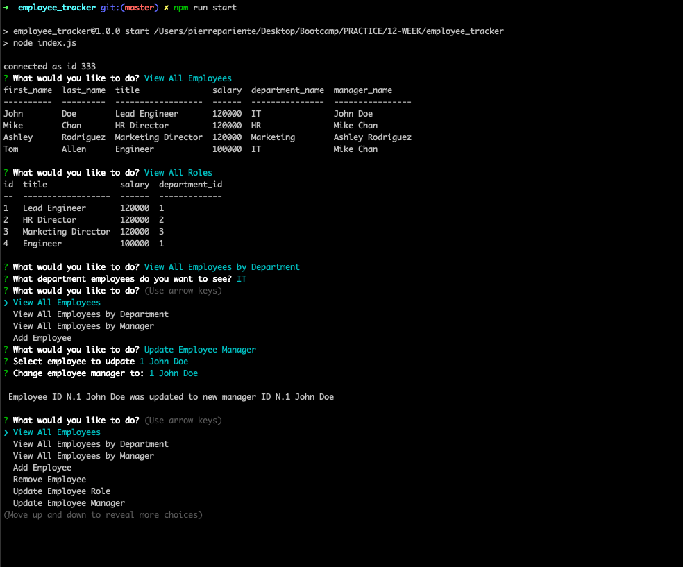

# Employee tracker

## Description

This employee tracker CLI application allows the user to view, add, update or delete employees.  

Here is the link to the [Repository](https://github.com/PierreParienteDimitrov/employee_tracker)
Here is the link to the [YouTube video](https://www.youtube.com/watch?v=8QV9uSNl57g&feature=youtu.be&ab_channel=PierrePariente)



## Table of Contents

- [Installation](#installation)
- [Start](#start)
- [Usage](#usage)
- [License](#license)

## Installation

Download the zip file or clone the project to your machine. Then run npm install to download the dependencies (inquirer and jest)

```terminal
npm install
```

## Usage

In order to run the application, enter the following command: 

```terminal
npm run start
```

## License

MIT License
